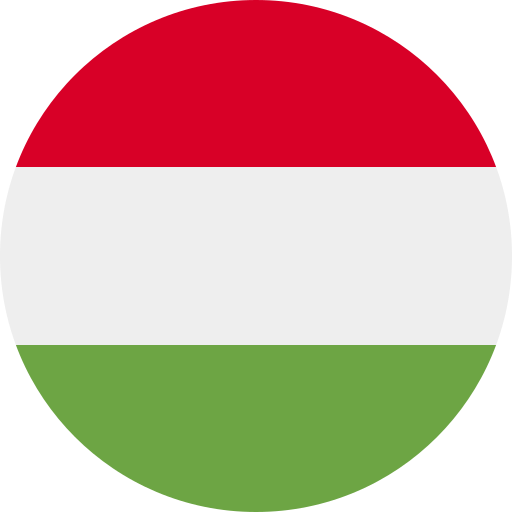
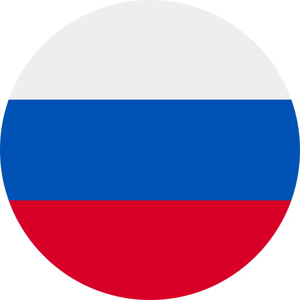

## What is Verlis?

#### Verlis is a game whose objective is to guess a word based on the alphabetical order of the propositions made.

 

 

## Rules

- Once a day (the countdown is visible in the menu), a new verb to guess is chosen at random from a list of <strong>12,164</strong>;
- The verbs proposed must be verbs in <strong>the selected language</strong>, in the <strong>infinitive</strong>;
- The accentuation (if applicable) of the letters <strong>must be</strong> respected;
- There is <strong>no limit</strong> on time or number of attempts;
- A diamond, after a verb, is divided vertically into two parts. Each represents the number of similar letters at the beginning or end of a word. Here are some examples: 
<strong>$${\color{#ff9c00}&#9671;}$$</strong> would mean <strong>no letters</strong> at the beginning or end of a word are similar. 
<strong>$${\color{#ff9c00}5 &#11030;}$$</strong> would mean that the <strong>first five</strong> letters of the word are similar. 
<strong>$${\color{#ff9c00}&#11031; 3}$$</strong> would mean that the <strong>last three</strong> letters of the word are similar. 
<strong>$${\color{#ff9c00}4 &#9670; 2}$$</strong> would mean that the <strong>first four</strong> and <strong>last two</strong> letters of the word are similar. 
Again, in French, diacritics do not affect the count. 
You can enable these hints in the <strong><em>Options</em></strong> menu.

 

## List of Decks

| Link																																| Topic											| Language			| Entries 	| Clues				  			| Sources		|
| ------------------------------------------------------------------- | --------------------------|			:---:			| --------- | ------------------- | --------- |
| [:link:](https://philjbt.github.io/Verlis/?deck=stars_hollywood)		| Hollwood actors						| &varnothing;	| 300				| Pictures of stars 	| [&ulcorner;Walk of Fame&lrcorner;](https://walkoffame.com/browse-stars/)&emsp;[&ulcorner;Tmdb&lrcorner;](https://www.themoviedb.org/) |
| [:link:](https://philjbt.github.io/Verlis/?deck=video_games)				| Videos games							| en						| 474				| 									 	| [&ulcorner;Pwn Rank&lrcorner;](https://www.pwnrank.com/top-500) |
| [:link:](https://philjbt.github.io/Verlis/?deck=knitting_en)				| Knitting									| en						| 474				| 									 	| [&ulcorner;Wiktionary&lrcorner;](https://en.wiktionary.org/wiki/Category:en:Knitting) |
| [:link:](https://philjbt.github.io/Verlis/?deck=verb_inf_cs-CZ)			|	Verbs in the infinitive		|	cs-CZ					| 190				| 					 					| [&ulcorner;Travel with Languages&lrcorner;](https://travelwithlanguages.com/blog/most-common-czech-words.html) |
| [:link:](https://philjbt.github.io/Verlis/?deck=verb_inf_da-DK)			|	Verbs in the infinitive		|	da-DK					| 514				| 					 					| [&ulcorner;Jan Simon&lrcorner;](https://github.com/janhsimon/DanishVerbs) |
| [:link:](https://philjbt.github.io/Verlis/?deck=verb_inf_de-DE)			|	Verbs in the infinitive		|	de-DE					| 17,679		| 										| [&ulcorner;Michael Gerstenberg&lrcorner;](https://github.com/michael-gerstenberg/GermanVerbScraper) |
| [:link:](https://philjbt.github.io/Verlis/?deck=verb_inf_el-GR)			|	Verbs in the infinitive		|	el-GR					| 163				| 					 					| [&ulcorner;Travel with Languages&lrcorner;](https://travelwithlanguages.com/blog/most-common-modern-greek-words.html) |
| [:link:](https://philjbt.github.io/Verlis/?deck=verb_inf_en-US)			|	Verbs in the infinitive		|	en-US					| 1,011			| 						 				| [&ulcorner;Drulac&lrcorner;](https://github.com/Drulac/English-Verbs-Conjugates) |
| [:link:](https://philjbt.github.io/Verlis/?deck=verb_inf_es-ES)			|	Verbs in the infinitive		|	es-ES					| 10,854		| 										| [&ulcorner;Cubiwan&lrcorner;](https://github.com/cubiwan/jsESverb) |
| [:link:](https://philjbt.github.io/Verlis/?deck=verb_inf_fi-FI)			|	Verbs in the infinitive		|	fi-FI					| 7,049			| 						 				| [&ulcorner;Abhishek Suresh&lrcorner;](https://github.com/absu5530/morphological_classifier) |
| [:link:](https://philjbt.github.io/Verlis/?deck=verb_inf_fr-CA)			|	Verbs in the infinitive		|	fr-CA					| 5,602			| 						 				| [&ulcorner;UsherBrooke&lrcorner;](https://usito.usherbrooke.ca) |
| [:link:](https://philjbt.github.io/Verlis/?deck=verb_inf_fr-FR)			|	Verbs in the infinitive		|	fr-FR					| 12,164		| 										| [&ulcorner;Umontreal&lrcorner;](http://rali.iro.umontreal.ca) |
| [:link:](https://philjbt.github.io/Verlis/?deck=verb_inf_hu-HU)			|	Verbs in the infinitive		|	hu-HU					| 182				| 					 					| [&ulcorner;Travel with Languages&lrcorner;](https://travelwithlanguages.com/blog/most-common-hungarian-words.html) |
| [:link:](https://philjbt.github.io/Verlis/?deck=verb_inf_it-IT)			|	Verbs in the infinitive		|	it-IT					| 12,891		| 										| [&ulcorner;Roman Manasyan&lrcorner;](https://github.com/rmanasyan/italianverbsnext) |
| [:link:](https://philjbt.github.io/Verlis/?deck=verb_inf_nb-NO)			|	Verbs in the infinitive		|	nb-NO					| 157				| 										| [&ulcorner;Lukas&lrcorner;](https://github.com/YesUseY/Norwegian-language-verbs-training-program) |
| [:link:](https://philjbt.github.io/Verlis/?deck=verb_inf_nl-NL)			|	Verbs in the infinitive		|	nl-NL					| 180				| 					 					| [&ulcorner;Dimitri Witkowski&lrcorner;](https://github.com/antelle/sterke-werkwoorden) |
| [:link:](https://philjbt.github.io/Verlis/?deck=verb_inf_pt-BR)			|	Verbs in the infinitive		|	pt-BR					| 5,001			| 						 				| [&ulcorner;Edmundo Biglia&lrcorner;](https://github.com/edmundobiglia/ptbr-top-verbs) |
| [:link:](https://philjbt.github.io/Verlis/?deck=verb_inf_pt-PT)			|	Verbs in the infinitive		|	pt-PT					| 1,018			| 						 				| [&ulcorner;Troyciv&lrcorner;](https://github.com/Troyciv/PT_ConjugationTrainer_Anki) |
| [:link:](https://philjbt.github.io/Verlis/?deck=verb_inf_ro-RO)			|	Verbs in the infinitive		|	ro-RO					| 586				| 					 					| [&ulcorner;Travel with Languages&lrcorner;](https://travelwithlanguages.com/blog/most-common-romanian-words.html)&emsp;[&ulcorner;Zeolan&lrcorner;](https://github.com/zeolan/digital-ocean-app) |
| [:link:](https://philjbt.github.io/Verlis/?deck=verb_inf_ru-RU)			|	Verbs in the infinitive		|	ru-RU					| 14,866		| 										| [&ulcorner;Badestrand&lrcorner;](https://github.com/Badestrand/russian-dictionary) |
| [:link:](https://philjbt.github.io/Verlis/?deck=verb_inf_sv-SE)			|	Verbs in the infinitive		|	sv-SE					| 471				| 					 					| [&ulcorner;Wiktionary&lrcorner;](https://en.wiktionary.org/wiki/Appendix:Swedish_verbs) |
| [:link:](https://philjbt.github.io/Verlis/?deck=verb_inf_th-TH)			|	Verbs in the infinitive		|	th-TH					| 260				| 					 					| [&ulcorner;Travel with Languages&lrcorner;](https://travelwithlanguages.com/blog/most-common-thai-words.html) |
| [:link:](https://philjbt.github.io/Verlis/?deck=verb_inf_uk-UA)			|	Verbs in the infinitive		|	uk-UA					| 155				| 					 					| [&ulcorner;Fiszkoteka&lrcorner;](https://fiszkoteka.pl/zestaw/309215-500-most-important-ukrainian-verbs-100-125)&emsp;[&ulcorner;Pinhok&lrcorner;](https://www.pinhok.com/kb/ukrainian/319/ukrainian-verbs/)&emsp;[&ulcorner;App 2 Brain&lrcorner;](https://app2brain.com/learn-languages/ukrainian/basic-verbs/)&emsp;[&ulcorner;My Languages&lrcorner;](https://mylanguages.org/ukrainian_verbs.php) |
| [:link:](https://philjbt.github.io/Verlis/?deck=verb_inf_vi-VN)			|	Verbs in the infinitive		|	vi-VN					| 374				| 					 					| [&ulcorner;MyLittle Word Land&lrcorner;](https://mylittlewordland.com/course/452073/vietnamese-verb-list) |

 

## Supported languages

> [!TIP]
> Click on a flag to open <em>Verlis</em> and display a list of decks available for that language.

 

## Keyboard keys

- The <em>Return</em> &#11176; key validates the proposal of a verb;
- The <em>Up Arrow</em> &#11205; key writes the last word tried (valid or not) in the text box;
- The <em>Down Arrow</em> &#11206; key deletes the contents of the text box.

 

# Good luck !

 

 

> [!NOTE]
> __THIRD PARTY CREDITS__\
> Framework : [&ulcorner;Bulma&lrcorner;](https://bulma.io)\
> Framework extension (tooltips) [&ulcorner;CreativeBulma&lrcorner;](https://bulma-tooltip.netlify.app/get-started/)\
> Framework extension (colored radios) [&ulcorner;Wikiki&lrcorner;](https://wikiki.github.io/form/checkradio/)\
> Javascript randomizer : [&ulcorner;Brian Ramsay&lrcorner;](https://github.com/BrianRamsay/Randomizer)\
> Flags : [&ulcorner;HatScripts&lrcorner;](https://github.com/HatScripts/circle-flags)
