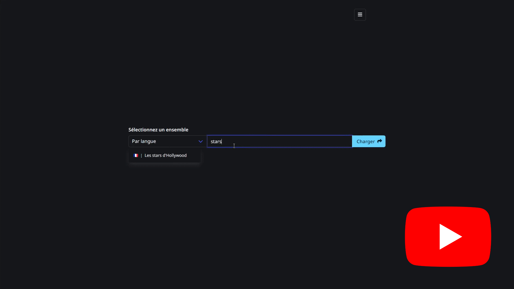

## Qu'est-ce que Verlis ?

Verlis est un jeu dont l'objectif est de deviner un verbe en fonction de l'ordre alphabétique des propositions faites.

## Les règles

- Une fois par jour (le décompte est visible dans le menu), un nouveau verbe à deviner est choisi au hasard parmis une liste de <strong>12 164</strong> ;
- Les verbes proposés doivent être des verbes en <strong>français</strong>, à <strong>l'infinitif</strong> ;
- L'accentuation des lettres <strong>doit être</strong> respectée ;
- Les diacritiques <strong>n'affectent pas</strong> l'ordre alphabétique des mots (ex : la lettre &laquo; <em>é</em> &raquo; est considérée comme un &laquo; <em>e</em> &raquo;) ;
- Il n'y a <strong>aucune limite</strong> de temps, ni de nombre de tentatives ;
- Le diamant, après un verbe, est divisé verticalement en deux parties. Chacune représente le nombre de lettres similaires en début ou en fin de mot. Voici des exemples : 
<strong>$${\color{#ff9c00}&#9671;}$$</strong> signifie <strong>qu'aucune lettre</strong> en début, ni en fin de mot, n'est similaire. 
<strong>$${\color{#ff9c00}5 &#11030;}$$</strong> signifierait que les <strong>cinq premières</strong> lettres du mot sont similaires. 
<strong>$${\color{#ff9c00}&#11031; 3}$$</strong> signifierait que les <strong>trois dernières</strong> lettres du mot sont similaires. 
<strong>$${\color{#ff9c00}4 &#9670; 2}$$</strong> signifierait que les <strong>quatre premières</strong> et les <strong>deux dernières</strong> lettres du mot sont similaires. 
Là encore, les diacritiques n'affectent pas le décompte. 
Il vous est possible d'activer ces indices dans le <strong>menu <em>Options</em></strong>.

## Les touches

- La touche <em>Entrée</em> &#11176; valide la proposition d'un verbe ;
- La touche <em>Flèche haut</em> &#11205; écrit le dernier mot essayé (valide ou non) dans la zone de texte ;
- La touche <em>Flèche bas</em> &#11206; supprime le contenu de la zone de texte.

# Bonne chance !

 

 

> [!NOTE]
> __THIRD PARTY CREDITS__\
> Framework : [Bulma](https://bulma.io)\
> Javascript randomizer : [Brian Ramsay](https://github.com/BrianRamsay/Randomizer)\
> Flags : [Lipis](https://github.com/lipis/flag-icons)\
> __Dictionnaires:__
> | Langue  		| Langage-Pays Code (ISO 639) 	| Url			|
> | ----------- | -----------------------------	| ------- |
> |	Tchèque			|	cs-CZ													| [https://travelwithlanguages.com/blog/most-common-czech-words.html](&#10102; TravelWithLanguages) |
> |	Danois  		|	da-DK													| [https://en.wiktionary.org/wiki/Appendix:Swedish_verbs](&#10102; Wiktionary) |
> |	Allemand  	|	de-DE													| [https://github.com/Troyciv/PT_ConjugationTrainer_Anki](&#10102; Troyciv) |
> |	Grec				|	el-GR													| [https://travelwithlanguages.com/blog/most-common-modern-greek-words.html](&#10102; TravelWithLanguages) |
> |	Anglais  		|	en-US													| [https://github.com/edmundobiglia/ptbr-top-verbs](&#10102; Edmundo Biglia) |
> |	Espagnol  	|	es-ES													| [https://github.com/antelle/sterke-werkwoorden](&#10102; Dimitri Witkowski) |
> |	Finnois  		|	fi-FI													| [https://github.com/YesUseY/Norwegian-language-verbs-training-program](&#10102; Lukas) |
> |	Français  	|	fr-FR													| [https://github.com/rmanasyan/italianverbsnext](&#10102; Roman Manasyan) |
> |	Hongrois		|	hu-HU													| [https://travelwithlanguages.com/blog/most-common-hungarian-words.html](&#10102; TravelWithLanguages) |
> |	Italien  		|	it-IT													| [http://rali.iro.umontreal.ca](&#10102; Umontreal) |
> |	Norvégien  	|	nb-NO													| [https://github.com/absu5530/morphological_classifier](&#10102; Abhishek Suresh) |
> |	Néerlandais	|	nl-NL													| [https://github.com/cubiwan/jsESverb](&#10102; Cubiwan) |
> |	Portugais  	|	pt-BR													| [https://github.com/david47k/top-english-wordlists](&#10102; David47k) |
> |	Portugais  	|	pt-PT													| [https://github.com/michael-gerstenberg/GermanVerbScraper](&#10102; Michael Gerstenberg) |
> |	Roumain			|	ro-RO													| [https://travelwithlanguages.com/blog/most-common-romanian-words.html](&#10102; TravelWithLanguages) [https://github.com/zeolan/digital-ocean-app](&#10103;) |
> |	Russe				|	ru-RU													| [https://github.com/Badestrand/russian-dictionary](&#10102; Badestrand) |
> |	Suédois  		|	sv-SE													| [https://github.com/janhsimon/DanishVerbs](&#10102; Jan Simon) |
> |	Thaï				|	th-TH													| [https://travelwithlanguages.com/blog/most-common-thai-words.html](&#10102; TravelWithLanguages) |
> |	Ukrainien		|	uk-UA													| [https://fiszkoteka.pl/zestaw/309215-500-most-important-ukrainian-verbs-100-125](&#10102; Fiszkoteka) [https://www.pinhok.com/kb/ukrainian/319/ukrainian-verbs/](&#10103; Pinhok) [https://app2brain.com/learn-languages/ukrainian/basic-verbs/](&#10104; App2Brain) [https://mylanguages.org/ukrainian_verbs.php](&#10105; MyLanguages) |
> |	Vietnamien	|	vi-VN													| [https://mylittlewordland.com/course/452073/vietnamese-verb-list](&#10102; MyLittleWordLand) |