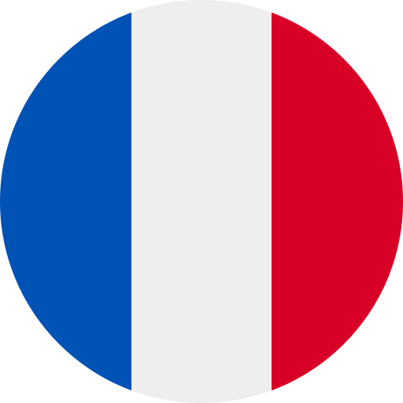
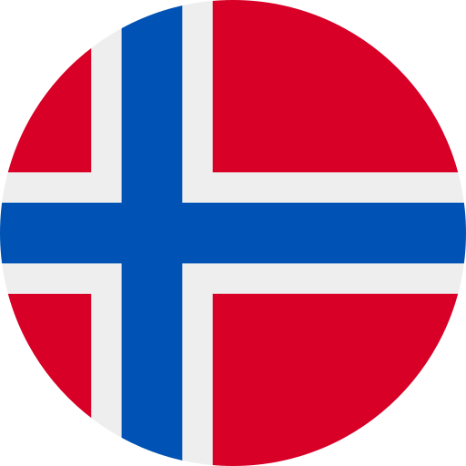
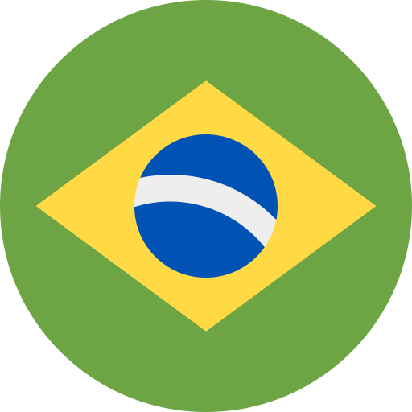
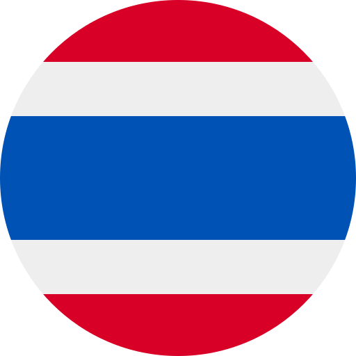

## What is Verlis?

Verlis is a game whose objective is to guess a verb based on the alphabetical order of the propositions made.

## Les règles

- Once a day (the countdown is visible in the menu), a new verb to guess is chosen at random from a list of <strong>12,164</strong>;
- The verbs proposed must be verbs in <strong>the selected language</strong>, in the <strong>infinitive</strong>;
- The accentuation (if applicable) of the letters <strong>must be</strong> respected;
- In french, diacritics <strong>do not</strong> affect the alphabetical order of words (e.g. the letter &laquo; <em>é</em> &raquo; is considered an &laquo; <em>e</em> &raquo;);
- There is <strong>no limit</strong> on time or number of attempts;
- A diamond, after a verb, is divided vertically into two parts. Each represents the number of similar letters at the beginning or end of a word. Here are some examples: 
<strong>$${\color{#ff9c00}&#9671;}$$</strong> would mean <strong>no letters</strong> at the beginning or end of a word are similar. 
<strong>$${\color{#ff9c00}5 &#11030;}$$</strong> would mean that the <strong>first five</strong> letters of the word are similar. 
<strong>$${\color{#ff9c00}&#11031; 3}$$</strong> would mean that the <strong>last three</strong> letters of the word are similar. 
<strong>$${\color{#ff9c00}4 &#9670; 2}$$</strong> would mean that the <strong>first four</strong> and <strong>last two</strong> letters of the word are similar. 
Again, if French, diacritics do not affect the count. 
You can enable these hints in the <strong><em>Options</em></strong> menu.

## Supported languages

                   

## Keyboard keys

- The <em>Return</em> key &#11176; validates the proposal of a verb;
- The <em>Up Arrow</em> key &#11205; writes the last word tried (valid or not) in the text box;
- The <em>Down Arrow</em> key &#11206; deletes the contents of the text box.

# Good luck !

 

 

> [!NOTE]
> __THIRD PARTY CREDITS__\
> Framework : [Bulma](https://bulma.io)\
> Javascript randomizer : [Brian Ramsay](https://github.com/BrianRamsay/Randomizer)\
> Flags : [Lipis](https://github.com/lipis/flag-icons)\
> __Dictionaries:__
> | Langue  							| Langage-Pays Code (ISO 639) 	| Url			|
> | --------------------- | -----------------------------	| ------- |
> |	Czech									|	cs-CZ													| [&#10102; TravelWithLanguages](https://travelwithlanguages.com/blog/most-common-czech-words.html) |
> |	Danish								|	da-DK													| [&#10102; Jan Simon](https://github.com/janhsimon/DanishVerbs) |
> |	German								|	de-DE													| [&#10102; Michael Gerstenberg](https://github.com/michael-gerstenberg/GermanVerbScraper) |
> |	Greek									|	el-GR													| [&#10102; TravelWithLanguages](https://travelwithlanguages.com/blog/most-common-modern-greek-words.html) |
> |	English								|	en-US													| [&#10102; Drulac](https://github.com/Drulac/English-Verbs-Conjugates) |
> |	Spanish								|	es-ES													| [&#10102; Cubiwan](https://github.com/cubiwan/jsESverb) |
> |	Finnish								|	fi-FI													| [&#10102; Abhishek Suresh](https://github.com/absu5530/morphological_classifier) |
> |	French								|	fr-FR													| [&#10102; Umontreal](http://rali.iro.umontreal.ca) |
> |	Hungarian							|	hu-HU													| [&#10102; TravelWithLanguages](https://travelwithlanguages.com/blog/most-common-hungarian-words.html) |
> |	Italian								|	it-IT													| [&#10102; Roman Manasyan](https://github.com/rmanasyan/italianverbsnext) |
> |	Norwegian							|	nb-NO													| [&#10102; Lukas](https://github.com/YesUseY/Norwegian-language-verbs-training-program) |
> |	Dutch									|	nl-NL													| [&#10102; Dimitri Witkowski](https://github.com/antelle/sterke-werkwoorden) |
> |	Portuguese (Brazil)  	|	pt-BR													| [&#10102; Edmundo Biglia](https://github.com/edmundobiglia/ptbr-top-verbs) |
> |	Portuguese (Portugal)	|	pt-PT													| [&#10102; Troyciv](https://github.com/Troyciv/PT_ConjugationTrainer_Anki) |
> |	Romanian							|	ro-RO													| [&#10102; TravelWithLanguages](https://travelwithlanguages.com/blog/most-common-romanian-words.html) [&#10103; Zeolan](https://github.com/zeolan/digital-ocean-app) |
> |	Russian								|	ru-RU													| [&#10102; Badestrand](https://github.com/Badestrand/russian-dictionary) |
> |	Swedish  							|	sv-SE													| [&#10102; Wiktionary](https://en.wiktionary.org/wiki/Appendix:Swedish_verbs) |
> |	Thai									|	th-TH													| [&#10102; TravelWithLanguages](https://travelwithlanguages.com/blog/most-common-thai-words.html) |
> |	Ukrainian							|	uk-UA													| [&#10102; Fiszkoteka](https://fiszkoteka.pl/zestaw/309215-500-most-important-ukrainian-verbs-100-125) [&#10103; Pinhok](https://www.pinhok.com/kb/ukrainian/319/ukrainian-verbs/) [&#10104; App2Brain](https://app2brain.com/learn-languages/ukrainian/basic-verbs/) [&#10105; MyLanguages](https://mylanguages.org/ukrainian_verbs.php) |
> |	Vietnamese						|	vi-VN													| [&#10102; MyLittleWordLand](https://mylittlewordland.com/course/452073/vietnamese-verb-list) |